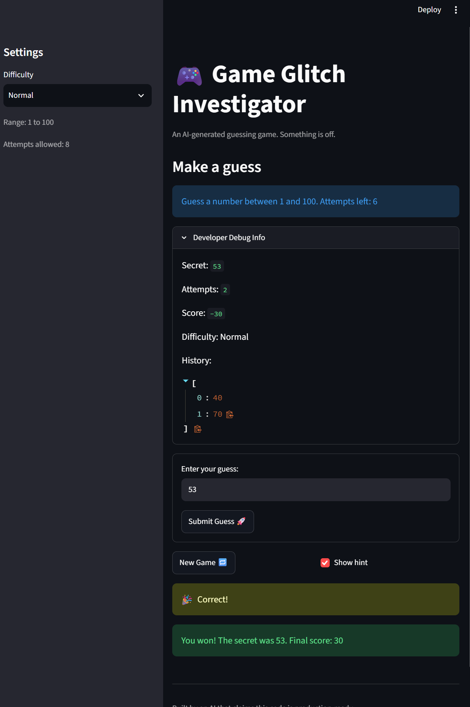

# 🎮 Game Glitch Investigator: The Impossible Guesser

## 🚨 The Situation

You asked an AI to build a simple "Number Guessing Game" using Streamlit.
It wrote the code, ran away, and now the game is unplayable. 

- You can't win.
- The hints lie to you.
- The secret number seems to have commitment issues.

## 🛠️ Setup

1. Install dependencies: `pip install -r requirements.txt`
2. Run the broken app: `python -m streamlit run app.py`

## 🕵️‍♂️ Your Mission

1. **Play the game.** Open the "Developer Debug Info" tab in the app to see the secret number. Try to win.
2. **Find the State Bug.** Why does the secret number change every time you click "Submit"? Ask ChatGPT: *"How do I keep a variable from resetting in Streamlit when I click a button?"*
3. **Fix the Logic.** The hints ("Higher/Lower") are wrong. Fix them.
4. **Refactor & Test.** - Move the logic into `logic_utils.py`.
   - Run `pytest` in your terminal.
   - Keep fixing until all tests pass!

## 📝 Document Your Experience

**Game's purpose:** A Streamlit number-guessing game. It picks a secret number in a difficulty-based range (Easy 1-20, Normal 1-100, Hard 1-50), and the player has a limited number of attempts to find it using "Too High"/"Too Low" hints, with a running score across guesses.

**Bugs found:**
1. The "Too High"/"Too Low" hint messages were reversed in `check_guess` (a too-high guess told you to go higher, not lower), in both the normal comparison and the string-secret fallback branch used on alternating attempts.
2. Clicking "New Game" didn't reset the game: `status` was never reset back to `"playing"`, so the previous win/loss message kept blocking the page; `history` was never cleared; and the guess input box kept its last typed value.
3. The "Guess a number between..." message was hardcoded to always say "1 and 100," even on Easy/Hard difficulty, instead of using the `low`/`high` values `get_range_for_difficulty` already returns correctly.
4. Switching the Difficulty dropdown mid-session never regenerated the secret number: `st.session_state.secret` was only ever set once (on the very first run, using whichever difficulty was selected then). Switching e.g. Normal -> Easy kept the old secret, which could easily land outside the new, smaller range (reported case: secret 83 left over on Easy's 1-20 range).

**Fixes applied:**
- Swapped the hint messages in `check_guess` in both code paths, and refactored the function (along with the other game logic) out of `app.py` into `logic_utils.py` so it could be unit tested directly.
- Reset `status` and `history` on New Game, and added a `game_id` counter baked into the guess input's widget key so New Game always produces a fresh, empty input box instead of reusing a stale one.
- Rewrote the range message to use `low`/`high` instead of a hardcoded "1 and 100" (this was a side effect of the Enhanced UI work below, where that line was rewritten anyway).
- Added input validation (`validate_range` in `logic_utils.py`): a guess that's non-numeric or outside the selected difficulty's range is now rejected with a clear message ("Enter a number between X and Y." / "That is not a number.") and does **not** consume an attempt or get added to the guess history.
- Added difficulty-change detection in `app.py`: whenever the selected difficulty differs from the one tracked in `st.session_state.difficulty`, the game fully resets (new in-range secret, attempts, history, status, and a fresh guess input), the same way "New Game" does.

## 📸 Demo Walkthrough

Secret number is 53 (Normal difficulty, range 1 to 100).

1. User enters a guess of 40. The game returns "Too Low" with the hint "Go HIGHER!", and the score drops to -5.
2. User enters a guess of 70. The game returns "Too High" with the hint "Go LOWER!", and the score drops to -10.
3. User enters a guess of 53. The game returns "Correct!", the app shows "You won! The secret was 53. Final score: 30".
4. User clicks "New Game". A new secret is picked (respecting the selected difficulty's range), the guess history clears, the guess box is blanked, and the win message disappears so the game is immediately playable again. (Note: score is not reset by "New Game" and carries over between games.)

**Screenshot** *(optional)*: <!-- Insert a screenshot of your fixed, winning game here -->


## 🧪 Test Results

```
(.venv) PS C:\Users\sinha\Desktop\AI110\ai110-module1show-gameglitchinvestigator-starter> python -m pytest -v
============================= test session starts =============================
platform win32 -- Python 3.14.7, pytest-9.1.1, pluggy-1.6.0
rootdir: C:\Users\sinha\Desktop\AI110\ai110-module1show-gameglitchinvestigator-starter
plugins: anyio-4.15.1
collected 27 items

tests/test_difficulty_switch.py::test_secret_regenerates_in_range_when_switching_to_easy PASSED [  3%]
tests/test_difficulty_switch.py::test_secret_regenerates_in_range_when_switching_to_hard PASSED [  7%]
tests/test_difficulty_switch.py::test_switching_difficulty_resets_attempts_and_history PASSED [ 11%]
tests/test_difficulty_switch.py::test_switching_difficulty_updates_the_range_caption PASSED [ 14%]
tests/test_game_logic.py::test_winning_guess PASSED                      [ 18%]
tests/test_game_logic.py::test_guess_too_high_outcome PASSED             [ 22%]
tests/test_game_logic.py::test_guess_too_low_outcome PASSED              [ 25%]
tests/test_game_logic.py::test_guess_too_high_message_tells_player_to_go_lower PASSED [ 29%]
tests/test_game_logic.py::test_guess_too_low_message_tells_player_to_go_higher PASSED [ 33%]
tests/test_game_logic.py::test_guess_too_high_message_matches_outcome_for_string_secret PASSED [ 37%]
tests/test_game_logic.py::test_guess_too_low_message_matches_outcome_for_string_secret PASSED [ 40%]
tests/test_input_validation.py::test_validate_range_accepts_value_within_range PASSED [ 44%]
tests/test_input_validation.py::test_validate_range_accepts_boundary_values PASSED [ 48%]
tests/test_input_validation.py::test_validate_range_rejects_value_above_high PASSED [ 51%]
tests/test_input_validation.py::test_validate_range_rejects_value_below_low PASSED [ 55%]
tests/test_input_validation.py::test_out_of_range_guess_does_not_count_as_an_attempt_or_history PASSED [ 59%]
tests/test_input_validation.py::test_non_numeric_guess_does_not_count_as_an_attempt_or_history PASSED [ 62%]
tests/test_input_validation.py::test_valid_guess_still_counts_as_an_attempt_and_history PASSED [ 66%]
tests/test_new_game_reset.py::test_new_game_resets_status_after_a_win PASSED [ 70%]
tests/test_new_game_reset.py::test_new_game_clears_history PASSED        [ 74%]
tests/test_new_game_reset.py::test_new_game_clears_the_guess_input_box PASSED [ 77%]
tests/test_parse_guess_edge_cases.py::test_parse_guess_rejects_non_numeric_string PASSED [ 81%]
tests/test_parse_guess_edge_cases.py::test_parse_guess_rejects_empty_string PASSED [ 85%]
tests/test_parse_guess_edge_cases.py::test_parse_guess_rejects_none_input PASSED [ 88%]
tests/test_parse_guess_edge_cases.py::test_parse_guess_accepts_negative_numbers PASSED [ 92%]
tests/test_parse_guess_edge_cases.py::test_parse_guess_truncates_decimal_strings PASSED [ 96%]
tests/test_parse_guess_edge_cases.py::test_parse_guess_rejects_whitespace_only_string PASSED [100%]

============================= 27 passed in 5.60s ==============================
```

## 🚀 Stretch Features

**Advanced Edge-Case Testing:** Added `tests/test_parse_guess_edge_cases.py` with 6 pytest cases targeting `parse_guess` edge cases: a non-numeric string, an empty string, `None` input, a negative number, a decimal string, and a whitespace-only string. All 6 pass (see the Test Results output above). Prompts used and reasoning for each case are documented in `ai_interactions.md`.

**Feature Expansion via Agent Mode:** Added a Guess History sidebar (`app.py`) that lists every guess made this game, most recent first, with an icon and outcome per guess (e.g. `🎉 #4: 55 -> Win`), instead of guesses only being visible inside the hidden "Developer Debug Info" expander. It clears correctly on "New Game," same as the rest of the game state. Full agent workflow (task given, steps taken, manual verification) documented in `ai_interactions.md`.

**Professional Documentation and Style:** Ran `flake8` against `logic_utils.py`, `app.py`, and `tests/`; it flagged 4 over-long lines in `app.py`, all now wrapped and fixed (`flake8` is clean on a second run). Every function in `logic_utils.py` now has a full Args/Returns docstring instead of a one-line summary. Prompt used, before/after linting output, and a list of the changes applied are documented in `ai_interactions.md`.

**Enhanced Game UI and Formatting:** Added a Hot/Cold proximity hint (`get_proximity_hint` in `logic_utils.py`) shown under the existing Too High/Too Low hint, e.g. "Proximity: 🔥 Hot," scaled to the selected difficulty's range so "hot" means the same thing on Easy as on Hard. Also replaced the plain "Attempts left: N" text in `app.py` with `st.metric` tiles for Score, Attempts Left, and Difficulty, and fixed the range caption to use the actual `low`/`high` for the selected difficulty instead of a hardcoded "1 and 100" (this also fixed bug #3 from the bug table above). Added a "🔢 Numbers Guessed" number-line chart (Altair) at the bottom of the page: every numeric guess this game is plotted along the difficulty's actual range, color-coded by outcome (Too Low/Too High/Win), with the guess value labeled above each point. Core game logic (scoring, win/loss detection) is unchanged.
